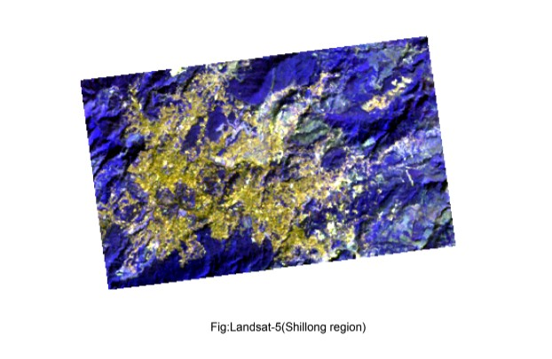
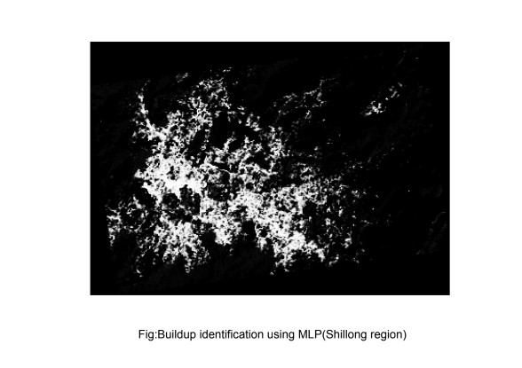

# Utilizing Deep Learning for the Identification of Buildup in the Shillong Region
Buildup, also known as accumulation, is the gradual increase of a substance
over time in a specific area. This phenomenon can be observed in various forms,
such as sediment buildup in rivers, waste accumulation in landfills, and even the
buildup of pollutants in the atmosphere. The identification and management of
buildup is crucial for maintaining the health and sustainability of our
environment.

## Data
Landsat 5
This satellite was launched on March 1, 1984. Its sensor specification was the same
as the Landsat 4 which carried MultiSpectral Scanner (MSS) and Thematic Mapper
instruments. This was the longest Operating Earth Observation Satellite which
delivered the data almost 29 years. Satellite was orbited the earth in
Sun-synchronous, near polar orbit, at an altitude of 705 km, at an angle 98.2 degrees
and circled the earth every 99 minutes. The satellite has a 30m spatial resolution and
a temporal resolution of 16 days with an equatorial crossing at 9:45 am +/- 15
minutes. The Landsat 5 provided the data in theWorldwide Reference
System-2(WRS-2) path/ row system, with the swath overlap. The swath overlap
varies from the Equator to towards poles i.e. Swath overlap is 7% at the Equator
and approximately 85% at higher latitudes.
## Tools Used

1. QGIS Desktop 3.26.2
It was used to edit, visualize and analyze spatial data, as well as create and
edit GIS maps.

2. Python
Python is a high-level, interpreted programming language that is widely
used for web development, scientific computing, data analysis, artificial
intelligence, and other applications. Python Libraries used are
● Numpy

● Pandas

● Scikit Learn

● Tensorflow

● GDAL

● Pyrsgis

3. Google Earth Engine
Google Earth Engine (GEE) is a cloud-based platform for planetary-scale
geospatial analysis that brings Google's massive computational capabilities
to bear on a variety of high-resolution satellite and other geospatial data. It
allows researchers, scientists, and developers to analyze and visualize large
datasets, such as Landsat and Sentinel-2 imagery, and perform complex
geospatial computations.

## Result

## Authors

- [@Harshit](https://www.github.com/HarshitT-T)

